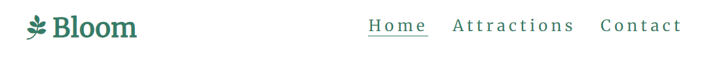
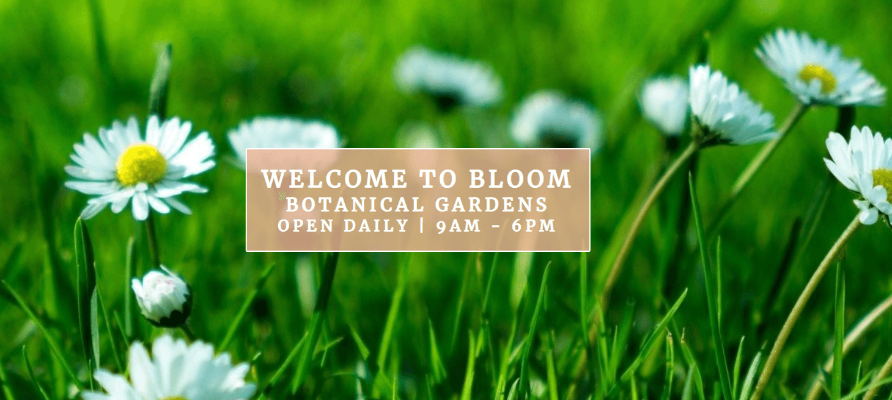
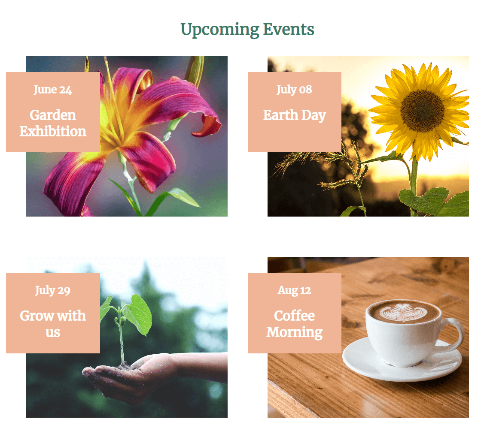
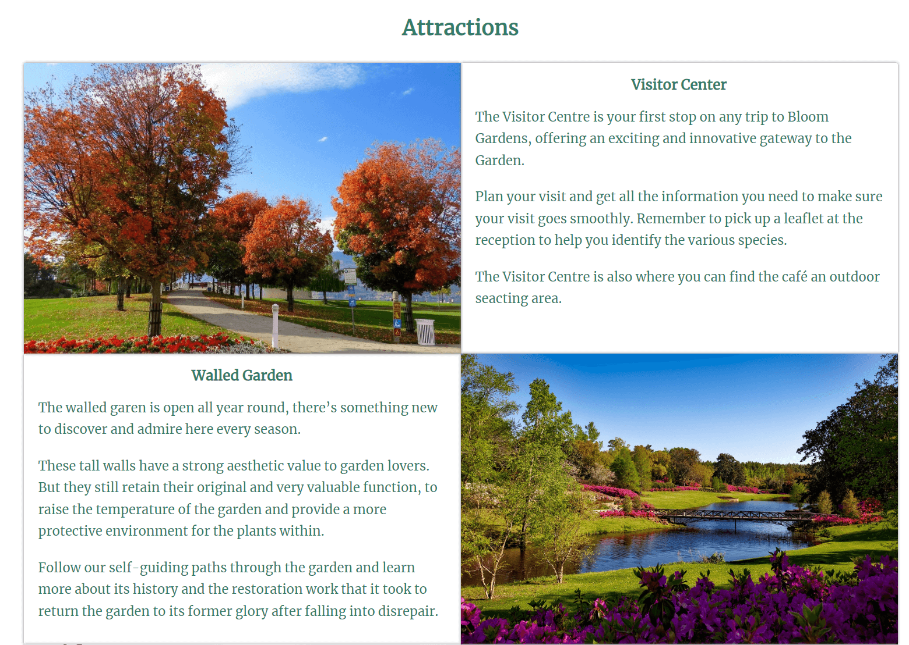

# Bloom

Bloom is a site for people who are interested in visiting a beautiful botanical garden in the west of Ireland. 
The site is targeted towards people who are looking for information about the garden before they visit.

## Features

* ### Navigation Bar:
    * The navigation bar is featured in all three pages. The fully responisve bar includes links to the Logo, Home page, attractions page and sign-up page and is identical on each page to allow for easy navigation.
    * This section will allow the user to easily navigate from page to page across all devices without having to revert back to the previous page via the 'back' button.

* ### The landing page image:
    * The landing page includes a photograph with text overlaw to allow the user to see the name of the garden.
    * This section provides the user with garden opening hours

* ### Event section:
    * This section will allow the user to see what events are on over the next few months. 
    * This section will be updated as these events change to keep the user up to date.

* ### The Footer:
    * The footer section includes contact details and links to the relevant social media sites for Bloom Gardens.
    * The links will open to a new tab to allow easy navigation for the user.

* ### Attractions:
    * The attractions section will provide the user with a description of the attraction and a supporitng image to see what the attraction looks like.
    * This section is valuable to the user as they will be able to easily identify attactions of interest to them.

* ### The Contact Page:
    * The page will allow the user to contact the Garden for more information or general enquiry. 
    * The user will be asked to submit thier full name, email address and message. The user will have the option of signing up for the newsletter. 

* #### Features left to implement:
TBD

* ### Testing:
    * I tested that this site works in different browsers: Chrome, Microsoft edge, Firefox, Safari.
    * I confirmed that this site is responsive, looks good and functions on all standard screen sizes using the devtools device.
    * I confirm that the navigation, header, about us and contact text are all readable and easy to understand.
    * I have confirmed that the form works: requires entries in every field, will only accept an email in the email field, and the submit button works.

### Validator Testing:
* HTML
    * No errors were returned when passing through the official W3C validator.
* CSs
    * No errors were found when passing through the official (Jigsaw) validator.
* Accessibility
    * I conformed that the colors and fonts used are easy to read and accessible by running it through lighthosue in devtools.

* ### Unfixed Bugs
No unfixed bugs

* ### Deployment
The site was deployed to GitHub pages. The steps to deploy are as follows
    * In the Github repository, navigate to the Setting tab
    * From the source section drop-down menu, select the Master Branch.
    * Once the Master Branch has been selected, the page will be automatically refreshed with a detailed ribbon display to indicate the succesful deployment.

* ### Credits
    * The inages on the Home, attractions and contact poage werer taken from  [Pexels](http://www.pexels.com/ "Pexels") 
    * The icons in the footer were taken from Font Awesome
