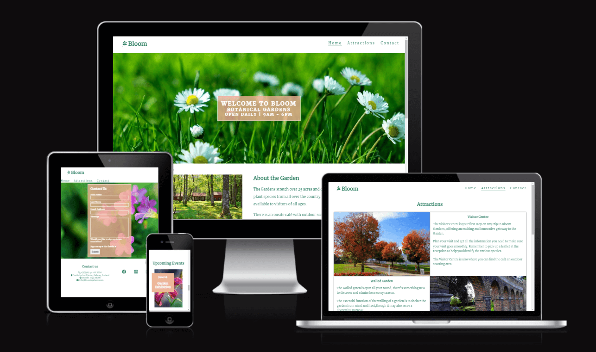
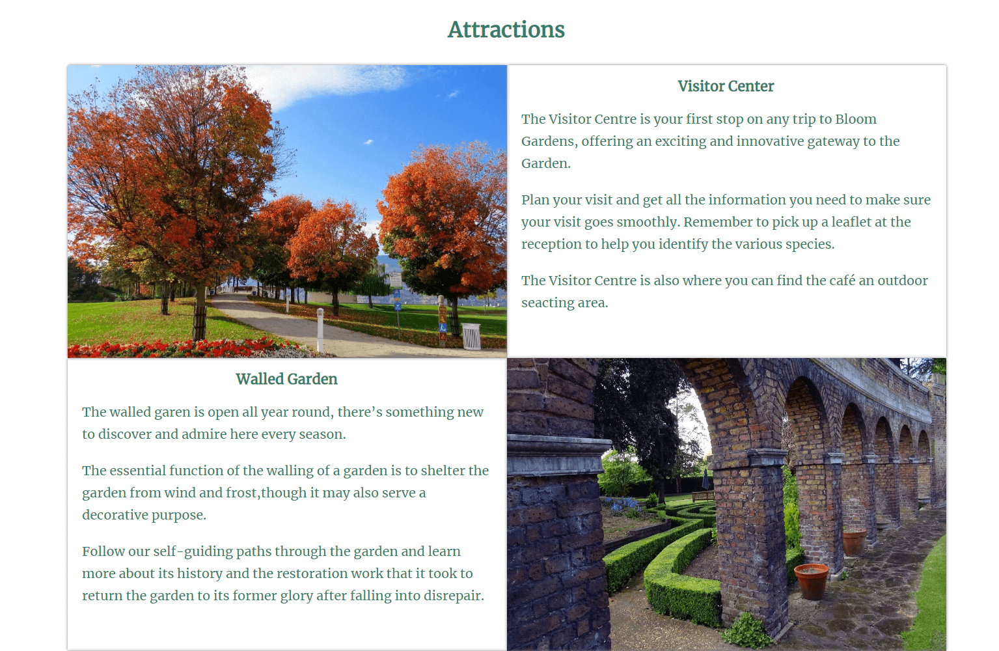

# Bloom

Bloom is a site for people who are interested in visiting a beautiful botanical garden in the west of Ireland. 
The site is targeted towards people who are looking for information about the garden before they visit.
- By Eric Blake

# [Live site](https://eric-blake.github.io/Bloom/ "Live site") 

## UX design

### Colors
* Keeping with the garden theme the color used for the headings and paragraphs is a light green #347c68.
* The background color used is the welcome message, upcoming events and contact form is a form of red rgba(240,180,150).

### Font
* The font used throughout is Merriweather

### Images
* All the images used throughout are for decorative purposed only. All the images on the site are from pexels.com.

### Wireframe
* The wireframe was created using Mockflow
  

## Features

* ### Navigation Bar:
    * The navigation bar is featured in all three pages. The fully responsive bar includes links to the Logo, Home page, attractions page and sign-up page and is identical on each page to allow for easy navigation.
    * This section will allow the user to easily navigate from page to page across all devices without having to revert back to the previous page via the 'back' button.

* ### The landing page image:
    * The landing page includes a photograph with text overlay to allow the user to see the name of the garden.
    * This section provides the user with garden opening hours

* ### Event section:
    * This section will allow the user to see what events are on over the next few months. 
    * This section will be updated as these events change to keep the user up to date.

* ### The Footer:
    * The footer section includes contact details and links to the relevant social media sites for Bloom Gardens.
    * The links will open to a new tab to allow easy navigation for the user.

* ### Attractions:
    * The attractions section will provide the user with a description of the attraction and a supporting image to see what the attraction looks like.
    * This section is valuable to the user as they will be able to easily identify attractions of interest to them.

* ### The Contact Page:
    * The page will allow the user to contact the Garden for more information or general enquiry. 
    * The user will be asked to submit their full name, email address and message. The user will have the option of signing up for the newsletter. 

* ### Features left to implement:
N/A

 ## Testing:

### Manual Testing
| Test | Result |
| ------------- | ------------- |
| This site works in different browsers: Chrome, Microsoft edge, Firefox, Safari.| Pass|
| This site is responsive, looks good and functions on all standard screen sizes using the devtools device. | Pass  |
| The navigation, header, about us and contact text are all readable and easy to understand. | Pass |
| The form works: requires entries in every field, will only accept an email in the email field, and the submit button works. | Pass |
  
### Validator Testing:
* HTML
    * No errors were returned when passing through the official W3C validator. 
    
* CSS
    * No errors were found when passing through the official (Jigsaw) validator.
    

* Accessibility
    * I confirmed that the colors and fonts used are easy to read and accessible by running it through lighthouse in devtools.
     #### Desktop 
     

     #### Mobile
     

## Bugs
* ### Fixed bugs
| Bug | Fix |
| ------------- | ------------- |
| Logo nav link on contact page not working | Corrected link |
| Home button in nav very close to edge of screen on small screens | Added border to push button out  |
| Attractions page had horizontal scroll bar at 1212px | Update media query to start from 1220px  |

* ### Unfixed Bugs
No unfixed bugs

## Deployment
 * The site was deployed to GitHub pages. The steps to deploy are as follows
 * In the Github repository, navigate to the Setting tab
 * From the source section drop-down menu, select the Master Branch.
 * Once the Master Branch has been selected, the page will be automatically refreshed with a detailed ribbon display to indicate the successful deployment.

## Credits
 * The images on the Home, attractions and contact pages were taken from [Pexels](https://www.pexels.com/ "Pexels") 
 * The icons in the footer were taken from [Font Awesome](https://fontawesome.com/ "Font Awesome")
 * Information and tips on using CSS Flexbox and Grid from my mentor Mitko Bachvarov
 * The code to make the CSS flexbox was taken from [CSS-tricks.com](https://css-tricks.com/snippets/css/a-guide-to-flexbox/ "CSS-tricks" )
 * The code to make the CSS Grid was taken from [CSS-tricks.com](https://css-tricks.com/snippets/css/complete-guide-grid/ "CSS-tricks")
 * Instructions throughout project was taken from [Code Institute](https://codeinstitute.net/ie/ "Code Institute") Tutorials and Love Running project.
 * Description of walled garden in Attractions sections from [Wikipedia ](https://en.wikipedia.org/wiki/Walled_garden "Wikipedia")
 * The wireframe was created using [Mockflow ](https://mockflow.com/ "Mockflow")
    
